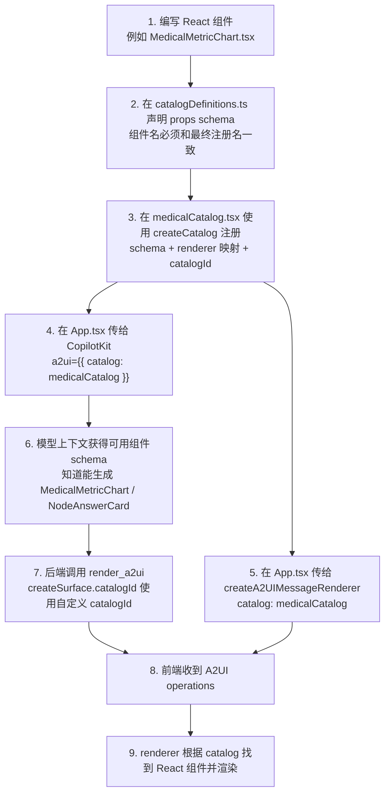

# A2UI 组件注册流程说明

这份文档说明 `a2ui-react-demo` 里自定义 A2UI 组件如何注册、模型如何知道这些组件、前端如何渲染这些组件，以及当前哪些组件已经注册成功。

## 当前注册状态

当前真正注册进 A2UI catalog 的自定义组件只有两个：

- `MedicalMetricChart`：医疗指标可视化组件，适合实验室指标、生命体征、风险评分等数值型内容。
- `NodeAnswerCard`：节点回答框组件，适合展示分析节点、工作流节点、推理步骤的结论、依据、置信度和下一步建议。

未注册的旧模板组件已经删除，当前目录只保留实际注册和渲染链路中使用的组件。

## 注册流程图



## 为什么必须同时配置两处 catalog

`createA2UIMessageRenderer({ catalog })` 只解决“收到组件树以后怎么渲染”的问题。

`<CopilotKit a2ui={{ catalog }} />` 解决“模型是否知道这些自定义组件存在”的问题。

如果只配置 renderer，模型大概率仍然只会生成 Basic Catalog 组件，页面看起来像“没用自定义组件”。所以正确写法是两处都传同一个 `medicalCatalog`。

```tsx
const A2UIRenderer = createA2UIMessageRenderer({
  theme: defaultTheme,
  catalog: medicalCatalog,
});

<CopilotKit
  runtimeUrl="http://localhost:8080/api/copilotkit"
  a2ui={{ catalog: medicalCatalog }}
  renderActivityMessages={[A2UIRenderer]}
>
  <CopilotChat />
</CopilotKit>
```

## 新增一个组件应该怎么做

假设要新增 `RiskTimeline`。

### 1. 写 React 组件

组件建议使用 `PropsOf` 从 catalog schema 推导类型，避免 schema 和组件 props 脱节。

```tsx
type RiskTimelineProps = PropsOf<typeof medicalCatalogDefinitions, "RiskTimeline">;

export function RiskTimeline({ props }: { props: RiskTimelineProps }) {
  return <section>{props.title}</section>;
}
```

### 2. 在 `catalogDefinitions.ts` 增加 schema

组件名 `RiskTimeline` 必须和后续 renderer key 完全一致。

```ts
RiskTimeline: {
  description: "用于展示医疗风险随时间变化的时间线组件。",
  props: z.object({
    title: z.string().describe("时间线标题。"),
    events: z.array(
      z.object({
        date: z.string().describe("日期文本。"),
        label: z.string().describe("事件名称。"),
        detail: z.string().optional().describe("事件说明。"),
      }),
    ),
  }),
},
```

### 3. 在 `medicalCatalog.tsx` 注册 renderer

```tsx
import { RiskTimeline } from "./RiskTimeline";

export const medicalCatalog = createCatalog(
  medicalCatalogDefinitions,
  {
    MedicalMetricChart: ({ props }) => <MedicalMetricChart props={props} />,
    NodeAnswerCard: ({ props }) => <NodeAnswerCard props={props} />,
    RiskTimeline: ({ props }) => <RiskTimeline props={props} />,
  },
  {
    catalogId: MEDICAL_CATALOG_ID,
    includeBasicCatalog: true,
  },
);
```

### 4. 更新后端提示词

如果希望模型主动使用新组件，需要在 `a2ui-agui/src/server.ts` 的提示词里补一句场景规则。例如：

```txt
当回答需要展示风险随时间变化、复查趋势或病程节点时，优先使用 RiskTimeline。
```

## 当前容易出错的点

- 只写了 React 组件，但没有写 `catalogDefinitions.ts` schema：模型不知道这个组件存在。
- schema 写了组件，但 `medicalCatalog.tsx` 没有 renderer 映射：前端收到组件树后找不到组件渲染。
- 只传给 `createA2UIMessageRenderer`，没有传给 `CopilotKit a2ui`：前端会渲染，但模型不知道能生成自定义组件。
- 后端 graph 节点仍指向 Basic Catalog：模型会倾向于不用自定义组件。
- `createSurface.catalogId` 使用了 Basic Catalog 或错误 ID：自定义组件不会命中当前 catalog。

## 当前项目结论

当前 `MedicalMetricChart` 和 `NodeAnswerCard` 的注册链路是正确的：

- 有 schema：`src/a2ui/catalogDefinitions.ts`
- 有 renderer 映射：`src/a2ui/medicalCatalog.tsx`
- 有统一 catalogId：`MEDICAL_CATALOG_ID`
- `App.tsx` 同时传给了 `CopilotKit a2ui` 和 `createA2UIMessageRenderer`
- 后端 graph 流程已经要求使用客户端自定义 catalog，并指定自定义 catalogId

后续新增组件时，建议直接按 `catalogDefinitions.ts` schema + `PropsOf` + `medicalCatalog.tsx` renderer 映射的方式实现。
