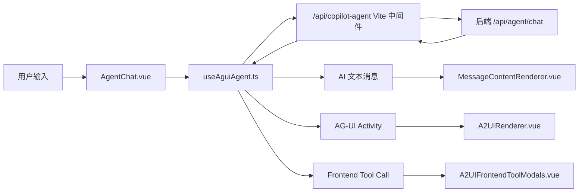

# A2UI Vue3 项目实现说明

## 1. 项目目标

`a2ui-vue3` 是一个基于 Vue 3 的医疗 AI 报告助手前端 Demo，目标是参考 `a2ui-react-demo` 的交互方式，在 Vue3 技术栈中接入 AG-UI/CopilotKit 请求协议，实现：

- 用户通过聊天输入报告、指标或问题。
- 前端按 AG-UI 协议把消息、工具定义、上下文发送给后端 Agent。
- 后端通过流式事件返回 AI 文本、A2UI activity 结构化 UI、工具调用请求。
- Vue 侧渲染医疗场景 UI，例如患者信息表单、检测指标弹窗、报告卡片、节点结论卡片。
- 前端表单提交后把结构化结果回传给 Agent，Agent 继续后续分析流程。

## 2. 使用技术

项目采用的主要技术如下：

| 类型 | 技术 | 作用 |
|---|---|---|
| 前端框架 | Vue 3 | 页面、组件和响应式状态管理 |
| 构建工具 | Vite 5 | 本地开发、构建、开发代理中间件 |
| 类型系统 | TypeScript | 协议、组件 props、工具参数类型约束 |
| AG-UI 客户端 | `@ag-ui/client` | 使用 `HttpAgent` 连接后端 Agent，接收流式事件 |
| AG-UI 协议类型 | `@ag-ui/core` | 使用 `Message`、`Tool`、`ActivityMessage` 等协议类型 |
| UI 组件库 | Ant Design Vue | 弹窗、表格、输入框、按钮等基础控件 |
| 图标 | `@ant-design/icons-vue` | 输入框发送、停止、添加等图标按钮 |
| Markdown 渲染 | `markdown-it` | AI 文本、表格、代码块、指令类内容渲染 |
| Schema 描述 | `zod` | A2UI catalog 组件 schema 描述 |

## 3. 总体架构

项目采用“协议层 + 运行态封装 + UI 渲染层 + 业务组件层”的分层方式：



### 请求链路

当前实际请求链路是：

```text
Vue 页面
  -> /api/copilot-agent
  -> Vite copilot-agent-adapter
  -> http://10.17.1.244:12307/api/agent/chat
```

前端组件中使用：

```vue
<AgentChat runtime-url="/api/copilot-agent" />
```

Vite 中间件负责把前端请求转成后端需要的 AG-UI `RunAgentInput` 结构，并保持 `text/event-stream` 流式返回。

## 4. AG-UI/CopilotKit 协议封装

协议封装核心在 `src/composables/useAguiAgent.ts`。

### 主要职责

- 创建 `HttpAgent`：

```ts
new HttpAgent({
  url: runtimeUrl,
  threadId: createId("thread"),
  debug: false,
})
```

- 发送用户消息：

```ts
agent.value.addMessage({
  id: createId("user"),
  role: "user",
  content: text,
});

await agent.value.runAgent({ tools: frontendTools }, subscriber);
```

- 监听 AG-UI 流式事件：

| 事件 | 前端处理 |
|---|---|
| `onRunStartedEvent` | 标记运行中 |
| `onTextMessageContentEvent` | 同步 AI 文本消息 |
| `onActivitySnapshotEvent` | 同步 A2UI activity |
| `onMessagesSnapshotEvent` | 同步完整消息快照 |
| `onToolCallEndEvent` | 识别前端工具调用，弹出对应弹窗 |
| `onRunFinishedEvent` | 收尾并同步最终消息 |
| `onRunErrorEvent` / `onRunFailed` | 展示错误消息 |

### 工具调用封装

前端定义了两个 Agent 可调用的 frontend tools：

| 工具名 | 作用 |
|---|---|
| `requestBasicInfoModal` | 弹出患者基本信息填写弹窗 |
| `requestInspectionIndicatorsModal` | 弹出检测指标填写/修改弹窗 |

工具定义在 `src/protocol/frontendTools.ts`，通过 `runAgent({ tools: frontendTools })` 发送给后端。后端 Agent 决定调用工具时，前端收到 tool call event，展示对应弹窗。用户提交后，前端追加一条 `role: "tool"` 消息，把结构化结果返回给 Agent，然后继续执行。

## 5. A2UI 渲染实现

Vue3 版本没有直接使用 `@copilotkit/a2ui-renderer`。原因是该库当前偏 React 生态，依赖 React/ReactDOM，不能直接作为 Vue 组件渲染器使用。

因此项目实现了 Vue 侧自定义 A2UI 渲染：

- `src/protocol/a2uiPayload.ts`：从 AG-UI activity content 中提取 `{ component, props }`。
- `src/protocol/a2uiCatalog.ts`：定义医疗场景组件 catalog 和 props schema。
- `src/components/a2ui/A2UIRenderer.vue`：根据 `component` 分发到 Vue 业务组件。

当前支持的 A2UI 组件：

| component | Vue 组件 | 作用 |
|---|---|---|
| `PatientInfoForm` | `PatientInfoForm.vue` | 患者基础信息表单 |
| `BloodGasMetricDynamicForm` | `BloodGasMetricDynamicForm.vue` | 血气指标动态补全 |
| `BloodGasDataConfirmCard` | `BloodGasDataConfirmCard.vue` | 血气数据确认卡片 |
| `BloodGasAnalysisReportCard` | `BloodGasAnalysisReportCard.vue` | 分析报告卡片 |
| `NodeAnswerCard` | `NodeAnswerCard.vue` | 流程节点回答卡片 |

未知 A2UI payload 会以 JSON 形式兜底展示，方便调试协议内容。

## 6. 前端工具弹窗实现

前端工具弹窗由 `A2UIFrontendToolModals.vue` 统一管理。

### 患者基本信息弹窗

组件：`BasicInfoToolModal.vue`

能力：

- 根据 `fields` 控制只展示指定字段。
- 根据 `initialValue` 回填已识别信息。
- 下一次打开时，只展示缺失项；除非 Agent 指定要修改某些字段。
- 提交后返回 `type: "basicInfo"` 和完整 `value`。

### 检测指标弹窗

组件：`InspectionIndicatorsToolModal.vue`

能力：

- 支持默认指标列表：TAT、PIC、t-PAIC、TM、PT、APTT、TT、FIB、D-dimer、FDP、PLT、Hb、HCT。
- 支持后端传入自定义 `indicators`。
- 支持 `fields` 精确修改某些指标。
- 支持 `showAll` 展示全部指标，用于“修改指标/修改全部指标”这类没有指定单项的场景。
- 支持 `initialResults`、行内 `result/value/displayValue` 等多种初始值来源。
- 前端会缓存用户上一次提交的指标值，二次修改时不会丢失已填数据。
- 自动根据参考范围判断 `正常 / 偏高 / 偏低 / 待判断`。

## 7. 消息渲染优化

AI 回复使用 `MessageContentRenderer.vue` 渲染。

已实现能力：

- 普通文本按 Markdown 渲染。
- Markdown 表格渲染为更清晰的表格样式。
- 代码、命令、JSON、SQL 等内容自动识别为代码块。
- 代码块右上角提供复制按钮。
- 禁用 HTML 注入，降低渲染风险。

这样可以避免流式文本里出现 Markdown 表格、代码、命令时展示混乱。

## 8. 交互和视觉实现

主组件为 `AgentChat.vue`。

交互特点：

- 首屏保留医疗 AI 报告助手头部、状态和提示栏。
- 未开始对话时，输入区域居中展示。
- 开始对话后，切换为聊天列表 + 底部输入框布局。
- 输入框根据内容自适应高度，超过最大高度后内部滚动。
- 发送按钮使用图标；运行中切换为停止图标。
- 运行过程中展示 typing 动效。

样式集中在 `src/style.css`，主要使用医疗场景的青绿色视觉语言，保持清爽、克制、可读性优先。

## 9. 当前实现亮点

- 参考 React Demo 的协议链路，但适配为 Vue3 工程。
- 不依赖 React A2UI renderer，而是实现 Vue 原生 A2UI 分发渲染。
- 支持 AG-UI 流式消息、activity、frontend tool call 三类核心事件。
- 表单弹窗与 Agent tool result 闭环打通。
- 针对医疗报告场景做了表单补全、指标修改、异常判断、报告卡片展示。
- 对 Markdown、代码块、表格进行增强渲染，提升 AI 输出可读性。
- 处理了多轮修改中的前端状态保留，避免已填值丢失。

## 10. 启动与构建

安装依赖：

```bash
npm install
```

启动开发环境：

```bash
npm run dev
```

默认访问：

```text
http://localhost:5174
```

构建：

```bash
npm run build
```

当前构建已通过。Vite 会提示 chunk 较大，这是 Ant Design Vue、AG-UI、Markdown 等依赖一起打包导致的体积提示，不影响功能运行。

